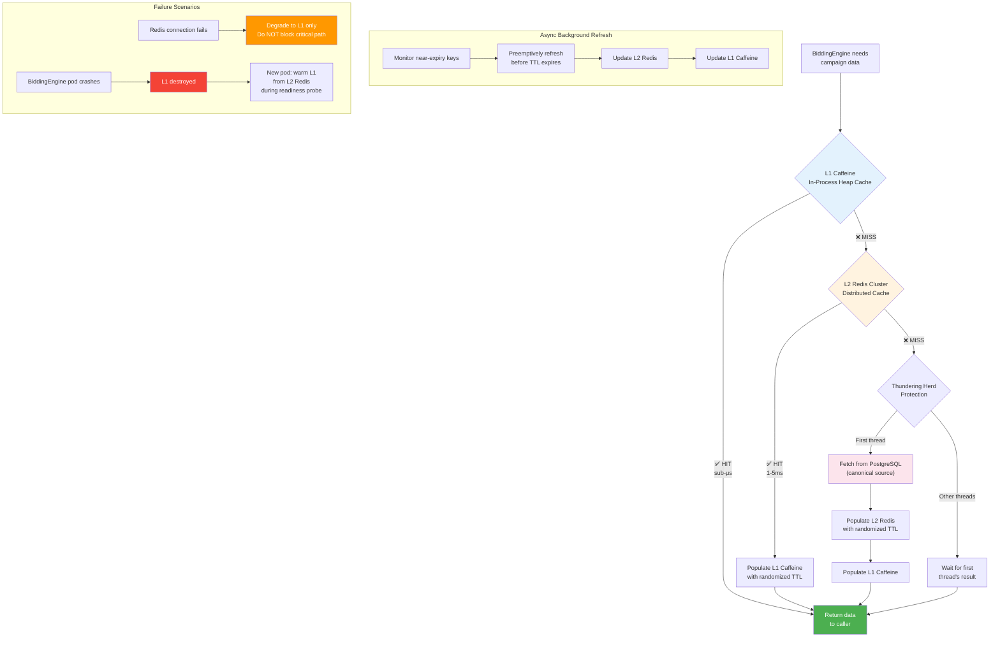
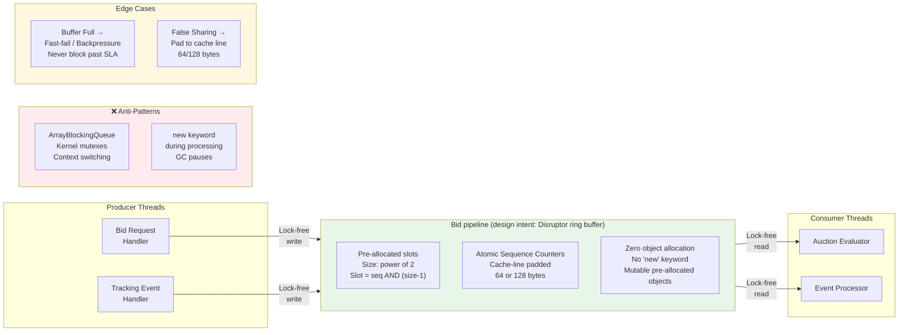
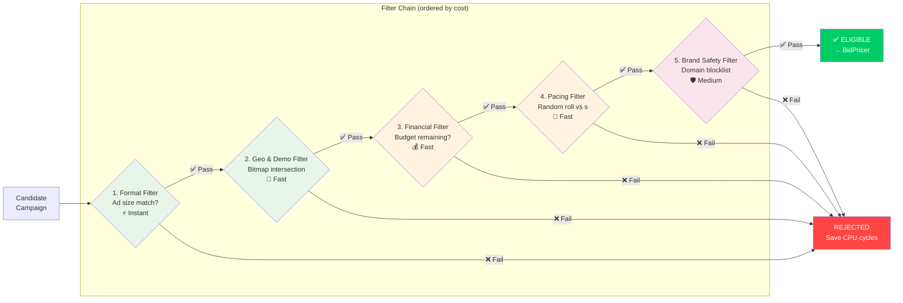
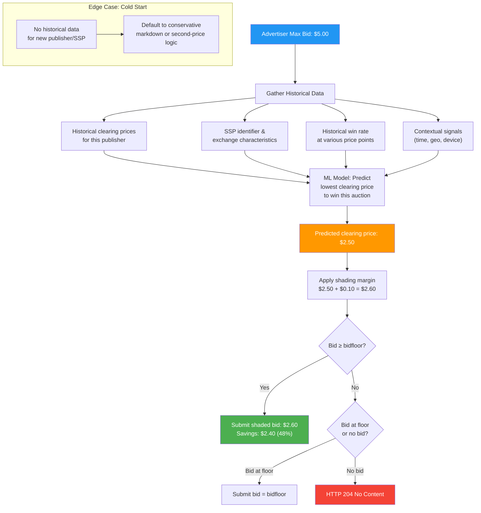
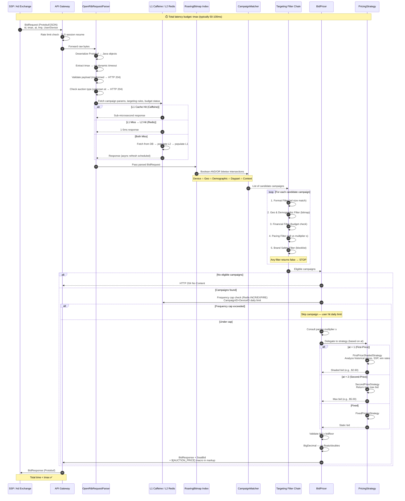
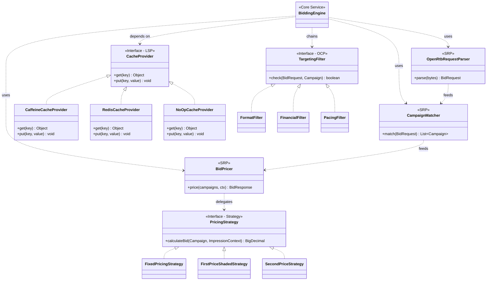
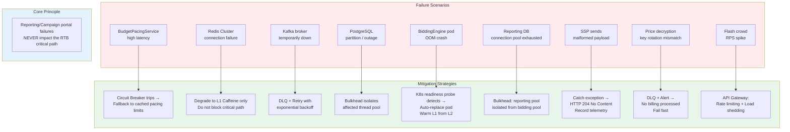

# Real-Time Bidding Engine (BiddingEngine)

## Overview
The `BiddingEngine` is the highly concurrent, ultra-low-latency core of the advertisement platform. It receives OpenRTB requests from Supply-Side Platforms (SSPs) or Ad Exchanges, evaluates millions of targeting permutations, calculates optimized bids via ML shading algorithms, and responds within a strict SLA (typically < 50-100ms).

## Core Responsibilities & Architecture

### 1. Protocol Integration
- Uses the `OpenRtbRequestParser` to parse incoming `BidRequest` payloads.
- **Protobuf Native**: Strictly uses Protobuf for binary deserialization to minimize CPU parsing overhead and GC pressure. Supports JSON as a fallback for non-compliant exchanges.
- Reads the dynamic `tmax` (timeout) field per request to dictate execution limits.

### 2. Multi-Tier Caching (No Blocking I/O)
- **Constraint**: No network-bound database queries are permitted within the RTB critical path.
- **L1 Cache (Caffeine)**: In-process heap caching providing sub-microsecond retrieval.
- **L2 Cache (Redis Cluster)**: Distributed caching providing 1-5ms fallback.
- Implements asynchronous cache-aside refresh to preemptively renew data before TTL expires, avoiding cache avalanches.

### 3. Index Concurrency

**As implemented.** `CampaignMatcher` guards its four maps and the Roaring Bitmap geo index with a
single `ReentrantReadWriteLock`. Bid evaluation takes the read lock; index mutations arriving from
`ad-events` take the write lock. Concurrent reads do not block each other, but a write blocks all
readers for its duration.

**Design intent, not built.** The LMAX Disruptor dependency has been removed from `pom.xml`; it was
never referenced in the source. The lock-free ring buffer, pre-allocated at startup with zero allocations on
the critical path and cache-line padded sequence counters, remains a target — worth revisiting only
if a benchmark shows the write lock is a real bottleneck at production write rates.

### 4. Inverted Indexing (RoaringBitmaps)
- Maintains an in-memory inverted index of eligible campaigns using `RoaringBitmap`.
- Performs rapid boolean AND/OR bitwise intersections across targeting dimensions (Geo, Device, Demographics, Dayparting, Context).
- **Memory Optimization**: Roaring Bitmaps divide 32-bit integers into chunks. If a chunk contains fewer than 4,096 elements, it is stored as a highly memory-efficient sorted array of 16-bit integers. If it exceeds this threshold, it upgrades to a traditional bitset container. Contiguous runs are compressed using Run-Length Encoding.
- **Index updates (as implemented)**: Kafka updates mutate the bitmaps in place under a write lock,
  which briefly blocks readers. Read-Copy-Update / double-buffering — building a new snapshot and
  swapping an `AtomicReference` so readers are never blocked — is design intent, not current
  behaviour.

### 5. Targeting Filter Chain (Chain of Responsibility)
Filters eligible campaigns from cheapest to most expensive computational cost:

If any filter returns `false`, the chain terminates immediately to conserve CPU cycles.

### 6. Bid Pricing (Strategy Pattern & Bid Shading)
The `BidPricer` combines budget pacing multipliers and auction-specific pricing strategies:
- **FirstPriceShadedStrategy**: Shades the bid down from the advertiser's max by a fixed
  `SHADING_FACTOR` constant, scaled by the pacing multiplier. The clearing-price model in the diagram
  below is *design intent, not built* — no prediction happens today.
- **SecondPriceStrategy**: Returns the true max bid, relying on exchange mechanics.
- **FixedPricingStrategy**: Static bid execution.
Always validates the final bid against the exchange's `bidfloor`.

## RTB Critical Path Flow Diagram
The core auction flow showing every step within the latency budget (< 50ms):

## SOLID Principles & GoF Design Patterns
This service is designed with highly isolated responsibilities to prevent the codebase from deteriorating into an unmanageable monolith:

- **SRP (Single Responsibility Principle)**: Responsibilities are strictly isolated. The `OpenRtbRequestParser` handles binary deserialization, `CampaignMatcher` handles set intersections, and `BidPricer` handles math. If the OpenRTB consortium releases a new protocol version, only the parser requires modification.
- **OCP (Open/Closed Principle)**: New targeting filters (e.g. sentiment analyzers) can be introduced via the `TargetingFilter` interface without modifying the core RTB loop. 
- **LSP (Liskov Substitution Principle)**: Multi-tier caching relies entirely on a generic `CacheProvider` interface allowing seamless swapping of implementations (`CaffeineCacheProvider`, `RedisCacheProvider`, `NoOpCacheProvider`) without altering execution behavior.
- **DIP (Dependency Inversion Principle)**: `CampaignRepository`, `SSPClient`, and Http clients are injected at runtime via Spring Boot/Guice (IoC container) for superior testing capability. The `new` keyword is never used for infrastructure dependencies.

## Resilience & Edge Cases
All subcomponents implement strict fault-tolerance:

- **JVM Warmup**: Uses dummy-traffic warmup scripts in Kubernetes readiness probes to trigger JIT compilation before routing live traffic. GraalVM Native Image support for Ahead-of-Time (AOT) compilation is utilized to drastically reduce startup time and memory footprint.
- **Malformed Payloads**: Fails fast (HTTP 204 No Content).
- **No Campaigns Found**: Returns HTTP 204 instead of constructing empty responses.

## Observability & Tracing (OpenTelemetry)
Deep observability is maintained via **OpenTelemetry**. Distributed tracing headers are injected into every incoming network request. These highly detailed traces flow into a centralized monitoring system (e.g., Jaeger/Grafana Tempo), allowing engineers to visualize the exact microsecond-level latency of a bid request as it passes through the API Gateway, checks the Caffeine L1 cache, intersects the Roaring Bitmaps, and formats the final OpenRTB binary response.

## Ecosystem Integration Points
How this service integrates with the broader Food Delivery platform:

- **CustomerApplication**: `CustomerApplication` calls `BiddingEngine` via FeignClient (`POST /api/v1/ads/serve`) when a user searches for food. The `BiddingEngine` evaluates targeting (geo, time, context) and returns sponsored listings. `CustomerApplication` implements a fallback that returns an empty list on failure, ensuring ad failures never block core food ordering.
- **ApiGateway**: OpenRTB bidding routes (`/api/v1/ads/**`) are mapped here for external SSPs and ad exchanges.
- **ConfigService**: Externalizes bid-shading parameters and cache TTLs.
